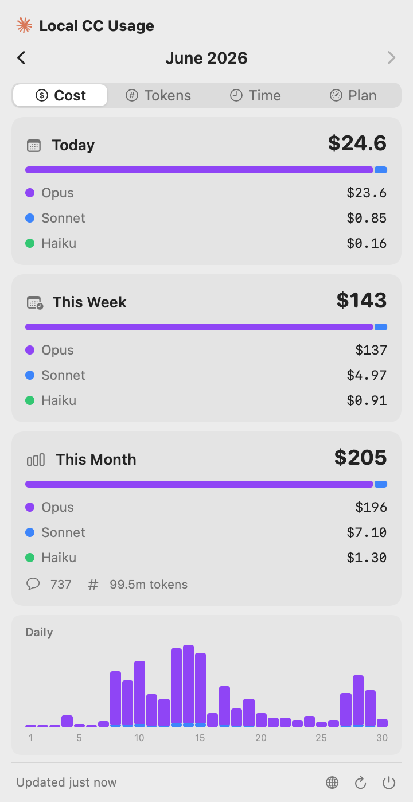
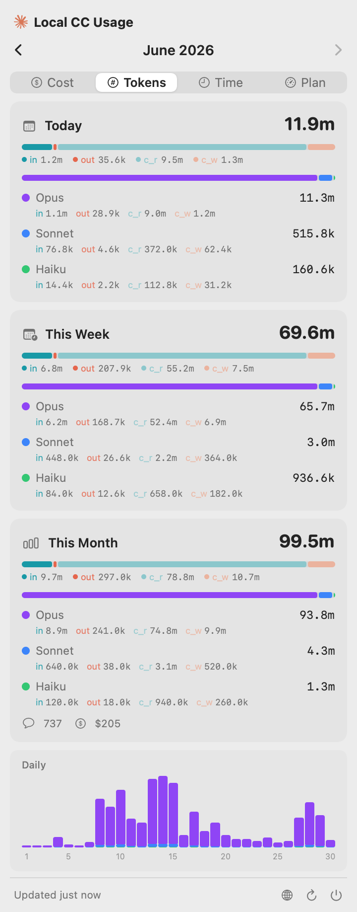
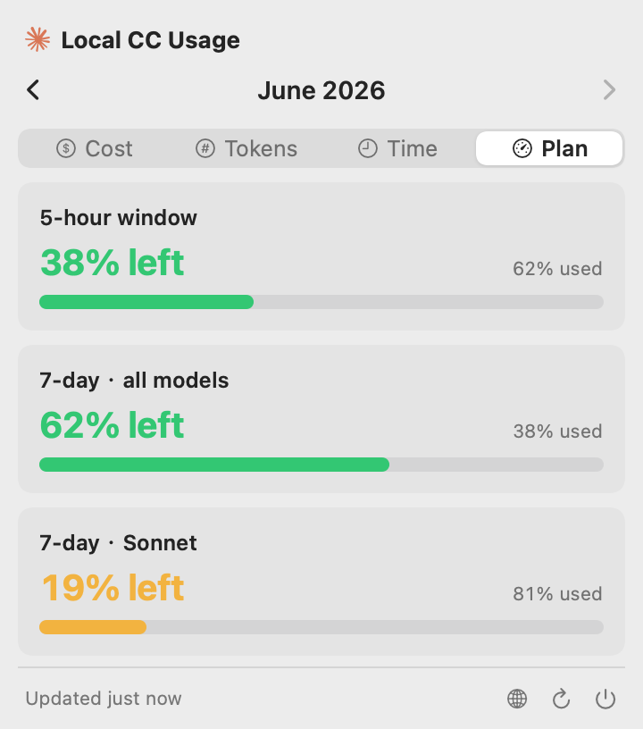
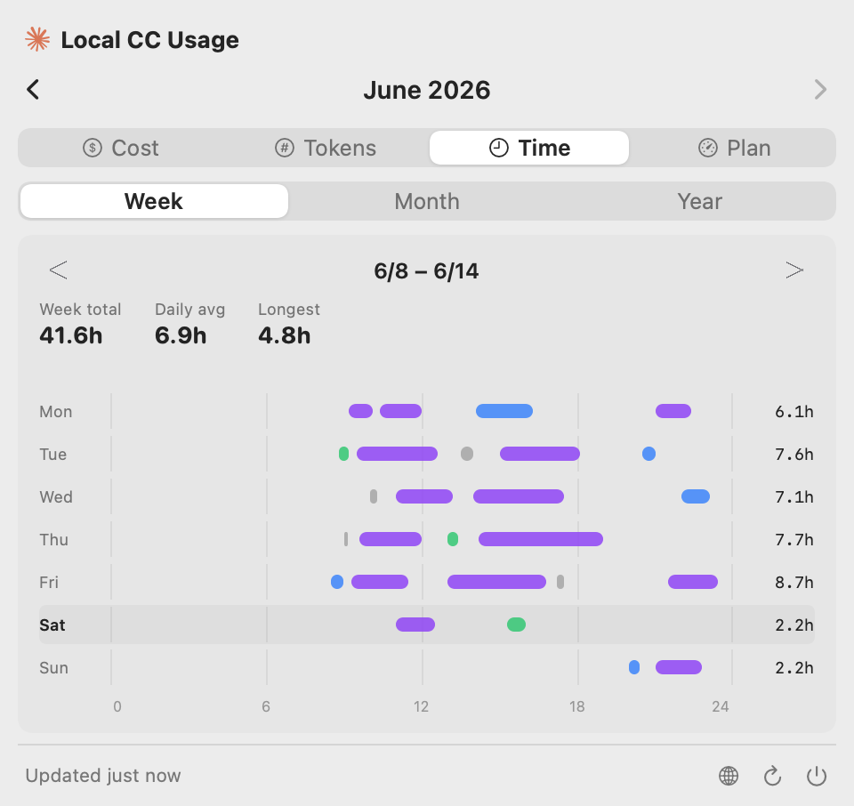
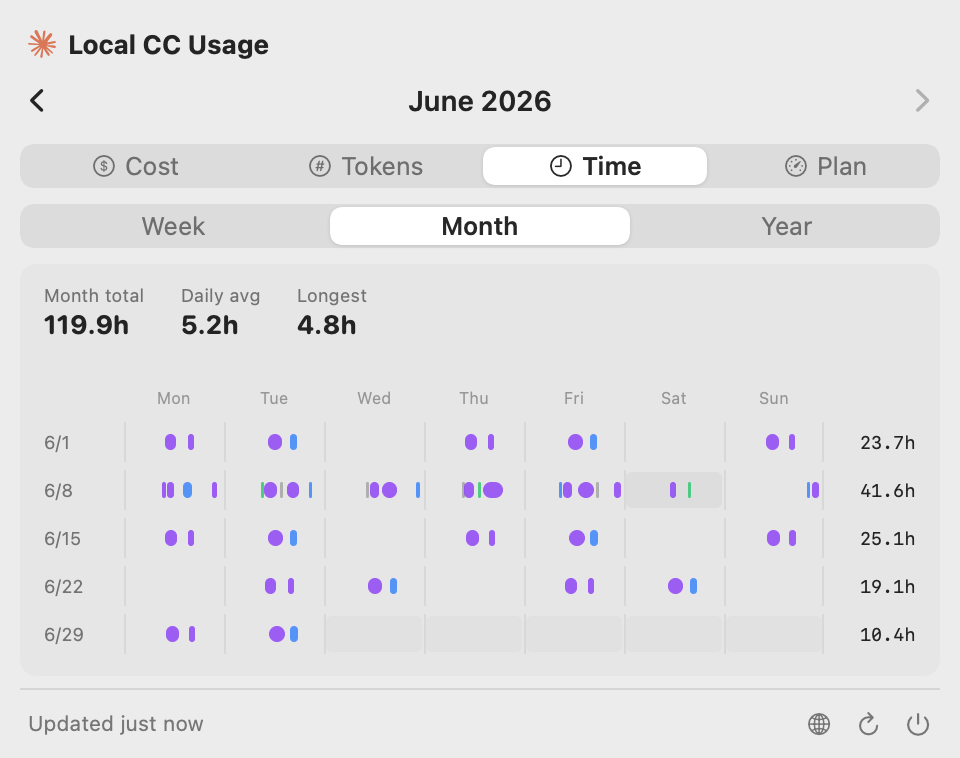
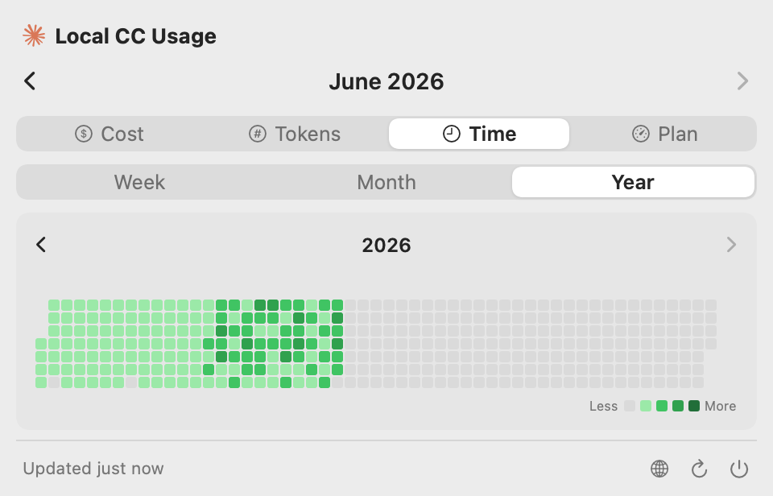

# CC Cost Monitor

[English](#english) | [中文](#中文)

<table>
  <tr>
    <td align="center"><br/><sub><b>Cost</b> — Today / Week / Month, per-model split, daily chart</sub></td>
    <td align="center"><br/><sub><b>Tokens</b> — by type (in / out / cache) and by model</sub></td>
    <td align="center"><br/><sub><b>Plan</b> — subscription quota left, with resets</sub></td>
  </tr>
  <tr>
    <td align="center"><br/><sub><b>Time · Week</b> — Apple-Health-style timeline, colored by model</sub></td>
    <td align="center"><br/><sub><b>Time · Month</b> — one row per week of the month</sub></td>
    <td align="center"><br/><sub><b>Time · Year</b> — GitHub-style activity heatmap</sub></td>
  </tr>
</table>

<sub>Screenshots are rendered from the app's real SwiftUI views (<code>docs/render_mockups.swift</code>) with synthetic demo data — no real usage.</sub>

---

## English

macOS menu bar app that shows how much you're spending on [Claude Code](https://docs.anthropic.com/en/docs/claude-code). Parses local session logs — zero tokens consumed, nothing sent anywhere.

### Why this exists

Claude Code's `/cost` only shows the current session. If you have multiple Anthropic accounts, use API keys, or connect through AWS Bedrock / GCP Vertex — good luck figuring out your total spend.

This app reads all your local session data and puts it in one place. One menu bar icon, done.

### What you get

- **Cost & Tokens** — switch views, with per-model breakdown (Opus / Sonnet / Haiku)
- **Time** — *when* you actually used Claude Code, derived from session timestamps:
  - **Week** — an Apple-Health-sleep-style timeline (Mon–Sun × 0–24h), each active block colored by the model in use
  - **Month** — the same timeline, one row per week of the month
  - **Year** — a GitHub-style activity heatmap
- **Subscription quota** (Pro / Max) — dedicated tab showing how much is *left* in the 5-hour, 7-day and 7-day Sonnet windows, with reset countdowns. Live from Anthropic's official usage endpoint — the same source Claude Code's `/usage` uses
- **Today / This Week / This Month** — token distribution by type (input, output, cache read, cache write)
- **Daily bar chart** — hover for details
- **Month navigation** — browse past months, cached locally
- **4 languages** — English, 简体中文, 繁體中文, 日本語
- **Auto-refresh** — watches your session logs and updates within seconds of real usage (rate-limited to once per 2 min), with a 30-min fallback timer + refresh on screen wake
- **Menu bar only** — no Dock icon, click app again to show popover

### Requirements

- macOS 13+, Intel or Apple Silicon
- Python 3
- Claude Code with session data in `~/.claude/projects/`

### Install

#### Download DMG

Grab `CCCostMonitor.dmg` from [Releases](../../releases), drag to Applications.

First launch: right-click → Open (bypasses Gatekeeper for unsigned apps).

#### Build from source

```bash
git clone https://github.com/kuen54/CCCostMonitor.git
cd CCCostMonitor
bash setup_signing.sh   # optional, one-time — see below
bash build.sh
open build/CCCostMonitor.app
```

> If `swiftc` complains about `redefinition of module 'SwiftBridging'`, run `bash fix_swift.sh`.

> **`setup_signing.sh`** (optional, run once) creates a stable self-signed code-signing
> identity so the app keeps a constant code identity across rebuilds. Without it the build
> falls back to ad-hoc signing, whose identity changes every build. This is a nicety, not a
> requirement: Keychain access for the OAuth token goes through Apple's `/usr/bin/security`
> tool, so the *Always Allow* grant is bound to that system binary and survives rebuilds
> either way.

#### Development notes

- **Tests** — `swift test` runs unit tests for the pure-logic `Core_*` files. It needs a
  **full Xcode 16+ toolchain**; Command Line Tools alone cannot build the SPM manifest
  (`Package.swift` exists only as a test harness — the app itself is built with plain
  `swiftc`). CI runs the tests on every push to `main` and on every PR.
- **Script sync guard** — `build.sh` bundles the analysis script (`Resources/analyze_usage.py`,
  or the dev copy at `~/.claude/skills/local-cc-cost/scripts/analyze_usage.py` when present).
  When both exist they must be byte-identical or the build fails; pass `--allow-drift` to
  downgrade that to a warning (the skill copy is what ships in that case).

### How it works

The app shells out to a bundled Python script that scans `~/.claude/projects/**/*.jsonl`, parses token usage from each session, and returns structured JSON. Pricing comes from [LiteLLM](https://github.com/BerriAI/litellm) (cached 24h).

```
~/.claude/projects/**/*.jsonl
    → analyze_usage.py --json
    → SwiftUI popover
```

The **Subscription** tab is separate: it calls Anthropic's OAuth usage endpoint directly (no local logs involved). The access token is read from `~/.claude/.credentials.json` or — the default on macOS — the login **Keychain** (`Claude Code-credentials`). macOS may prompt for Keychain access on first use; choose *Always Allow* (the grant is bound to the system `security` tool, so it persists across app updates and rebuilds). API-key users (Bedrock / Vertex / Console) have no subscription quota, so the tab is hidden for them.

### Project structure

No Xcode project — the app is compiled with plain `swiftc`. `Package.swift` exists only so `swift test` can run.

```
Sources/                    ← 16 Swift files
  main.swift                  ← entry point (single-instance check + bootstrap)
  AppDelegate.swift           ← menu bar item + title, popover, refresh timers, FSEvents watcher
  UsageStore.swift            ← published state + refresh orchestration
  UsageScriptClient.swift     ← runs the bundled Python script
  QuotaService.swift          ← subscription quota (OAuth) + Keychain access
  Views.swift                 ← UI (popover, charts)
  Formatters.swift            ← number formatting
  Localization.swift          ← i18n strings
  Models.swift                ← app-only OAuth/quota data models
  Core_*.swift                ← pure Foundation-only logic, unit-tested
                                (usage parsing, dates, model classes, Time-tab math)
Tests/CCCostCoreTests/      ← swift-testing unit tests for the Core_* files
Package.swift               ← test harness ONLY (app builds via swiftc)
Resources/analyze_usage.py  ← bundled Python analysis script
.github/workflows/build.yml ← CI: plist lint → py_compile → swift test → build → codesign verify → DMG artifact
build.sh                    ← compile (universal binary) + bundle + sign + DMG
setup_signing.sh            ← optional one-time stable self-signed identity
generate_icon.swift         ← ASCII-art app icon generator
fix_swift.sh                ← fixes the Command Line Tools modulemap conflict
Info.plist                  ← LSUIElement=true; single source of the version number
```

### On pricing accuracy

Costs are estimates based on public API pricing. If you're on a subscription plan (Pro / Max / Team), actual billing works differently — treat the numbers as a rough guide.

Token counts match [ccusage](https://github.com/ryoppippi/ccusage) within ~0.5%.

### A note on historical data ⚠️

This app can only show what's still on disk, and **Claude Code itself deletes old session files** — so your historical numbers can shrink or disappear over time, through no fault of this app.

Claude Code removes session transcripts (`~/.claude/projects/**/*.jsonl`) older than **`cleanupPeriodDays`** at startup. The default is **30 days**, so anything beyond roughly the last month gradually ages out and the totals for those months will drop. This is documented Claude Code behavior:

> *"How long to retain chat transcripts and session state locally. Default: 30 days."*
> — [Claude Code settings reference](https://code.claude.com/docs/en/settings) (`cleanupPeriodDays`)

If you want to keep long-term history, raise the setting in `~/.claude/settings.json` **before** old data ages out:

```json
{ "cleanupPeriodDays": 3650 }
```

> Note: deletion happens at the whole-file level. The `/compact` command, by contrast, only summarizes a session's *in-context* history — it appends a summary line and does **not** rewrite or delete the older lines already written to the transcript ([sessions docs](https://code.claude.com/docs/en/sessions)).

---

## 中文

macOS 菜单栏应用，查看 [Claude Code](https://docs.anthropic.com/en/docs/claude-code) 的用量和花费。解析本地会话日志 — 零 token 消耗，数据不会发送到任何地方。

### 为什么做这个

Claude Code 的 `/cost` 只显示当前会话。如果你有多个 Anthropic 账户、使用 API key、或通过 AWS Bedrock / GCP Vertex 接入 — 想搞清楚总花费几乎不可能。

这个应用读取所有本地会话数据，汇总到一个菜单栏图标里。

### 功能

- **费用 & Tokens** — 双视图切换，按模型分类（Opus / Sonnet / Haiku）
- **时长（Time）** — 从会话时间戳还原你**什么时候**在用 Claude Code：
  - **周视图** — 类似 Apple 健康「睡眠」的时间轴（周一~周日 × 0–24h），每段活跃色块按当时所用模型着色
  - **月视图** — 同样的时间轴，每行是该月的一周
  - **年视图** — GitHub 风格的活跃度热力图
- **订阅剩余用量**（Pro / Max）— 独立 tab，查看 5 小时 / 7 天 / 7 天 Sonnet 窗口**还剩多少**及重置倒计时。数据来自 Anthropic 官方用量接口 —— 与 Claude Code `/usage` 同源
- **今日 / 本周 / 本月** — 按类型拆分 token（输入、输出、缓存读、缓存写）
- **每日柱状图** — 悬浮查看详情
- **月份导航** — 浏览历史月份，本地缓存
- **4 种语言** — English、简体中文、繁體中文、日本語
- **自动刷新** — 监听本地会话日志，实际使用后数秒内更新（限速为每 2 分钟最多一次），另有 30 分钟兜底定时器 + 屏幕唤醒后刷新
- **仅菜单栏** — 无 Dock 图标，再次点击 app 可唤出弹窗

### 系统要求

- macOS 13+，Intel 或 Apple Silicon
- Python 3
- Claude Code 会话数据位于 `~/.claude/projects/`

### 安装

#### 下载 DMG

从 [Releases](../../releases) 下载 `CCCostMonitor.dmg`，拖入 Applications。

首次启动：右键 → 打开（绕过未签名应用的 Gatekeeper 检查）。

#### 从源码构建

```bash
git clone https://github.com/kuen54/CCCostMonitor.git
cd CCCostMonitor
bash setup_signing.sh   # 可选，一次性 — 见下方说明
bash build.sh
open build/CCCostMonitor.app
```

> 如果 `swiftc` 报错 `redefinition of module 'SwiftBridging'`，运行 `bash fix_swift.sh`。

> **`setup_signing.sh`**（可选，跑一次即可）会生成一个稳定的自签名代码签名证书，让 app
> 在多次重新构建之间保持恒定的代码身份。不跑它则回退到 ad-hoc 签名，其身份每次构建都变。
> 这只是锦上添花，并非必需：OAuth token 的钥匙串读取走的是 Apple 的 `/usr/bin/security`
> 系统工具，*始终允许*授权绑定在该系统二进制上，无论怎么重新构建都不会失效。

#### 开发说明

- **测试** — `swift test` 运行纯逻辑 `Core_*` 文件的单元测试，需要**完整的 Xcode 16+
  工具链**；仅装 Command Line Tools 无法构建 SPM manifest（`Package.swift` 只作为测试
  harness 存在 —— app 本身仍用 `swiftc` 直接编译）。CI 在每次 push 到 `main` 和每个
  PR 上运行测试。
- **脚本同步守卫** — `build.sh` 打包分析脚本（`Resources/analyze_usage.py`，机器上存在
  开发副本 `~/.claude/skills/local-cc-cost/scripts/analyze_usage.py` 时优先用后者）。两者
  同时存在时必须逐字节一致，否则构建失败；传 `--allow-drift` 可降级为警告（此时打包的是
  开发副本）。

### 工作原理

应用调用内置的 Python 脚本扫描 `~/.claude/projects/**/*.jsonl`，解析每个会话的 token 用量，返回结构化 JSON。定价数据来自 [LiteLLM](https://github.com/BerriAI/litellm)（缓存 24 小时）。

```
~/.claude/projects/**/*.jsonl
    → analyze_usage.py --json
    → SwiftUI 弹窗
```

**订阅** tab 走的是另一条路：直接调用 Anthropic 的 OAuth 用量接口（不读本地日志）。访问 token 从 `~/.claude/.credentials.json` 读取，或——在 macOS 上的默认情况——从登录**钥匙串**（`Claude Code-credentials`）读取。首次使用时 macOS 可能弹出钥匙串授权框，请选择*始终允许*（授权绑定在系统 `security` 工具上，升级或重新构建 app 都不会失效）。API-key 用户（Bedrock / Vertex / Console）没有订阅限额，该 tab 对他们隐藏。

### 项目结构

不依赖 Xcode 项目 —— app 直接用 `swiftc` 编译。`Package.swift` 仅用于跑 `swift test`。

```
Sources/                    ← 16 个 Swift 文件
  main.swift                  ← 入口（单实例检测 + 启动引导）
  AppDelegate.swift           ← 菜单栏图标与标题、弹窗、刷新定时器、FSEvents 监听
  UsageStore.swift            ← 状态发布 + 刷新编排
  UsageScriptClient.swift     ← 调用内置 Python 脚本
  QuotaService.swift          ← 订阅配额（OAuth）+ 钥匙串读取
  Views.swift                 ← UI（弹窗、图表）
  Formatters.swift            ← 数字格式化
  Localization.swift          ← 多语言文案
  Models.swift                ← 仅供 app 使用的 OAuth/配额数据模型
  Core_*.swift                ← 纯 Foundation 逻辑，有单元测试
                                （用量解析、日期、模型分类、Time tab 计算）
Tests/CCCostCoreTests/      ← swift-testing 单元测试（针对 Core_* 文件）
Package.swift               ← 仅作测试 harness（app 仍用 swiftc 构建）
Resources/analyze_usage.py  ← 内置 Python 分析脚本
.github/workflows/build.yml ← CI：plist 校验 → py_compile → swift test → 构建 → 签名校验 → DMG 产物
build.sh                    ← 编译（universal binary）+ 打包 + 签名 + DMG
setup_signing.sh            ← 可选，一次性生成稳定自签名证书
generate_icon.swift         ← ASCII art 风格图标生成器
fix_swift.sh                ← 修复 Command Line Tools modulemap 冲突
Info.plist                  ← LSUIElement=true；版本号的单一来源
```

### 关于费用准确性

费用基于公开 API 定价估算。如果你使用订阅计划（Pro / Max / Team），实际计费方式不同 — 数字仅供参考。

Token 计数与 [ccusage](https://github.com/ryoppippi/ccusage) 误差在 ~0.5% 以内。

### 关于历史数据 ⚠️

应用只能展示磁盘上还存在的数据，而 **Claude Code 自身会删除旧的会话文件** —— 所以历史数字可能随时间缩水甚至消失，这并非本应用的问题。

Claude Code 在启动时会删除超过 **`cleanupPeriodDays`** 的会话日志（`~/.claude/projects/**/*.jsonl`）。默认 **30 天**，因此大约一个月之前的数据会逐渐被清掉，那些月份的统计也会随之下降。这是 Claude Code 官方记录的行为：

> *"How long to retain chat transcripts and session state locally. Default: 30 days."*
> —— [Claude Code 设置文档](https://code.claude.com/docs/en/settings)（`cleanupPeriodDays`）

如果你想长期保留历史，**趁旧数据还没被清掉之前**，在 `~/.claude/settings.json` 里调大这个值：

```json
{ "cleanupPeriodDays": 3650 }
```

> 注：删除是整文件级别的。而 `/compact` 命令只是压缩会话的*上下文内*历史 —— 它追加一条摘要行，**不会**重写或删除已经写入 transcript 的旧行（[sessions 文档](https://code.claude.com/docs/en/sessions)）。

---

## License

[Apache 2.0](LICENSE)
